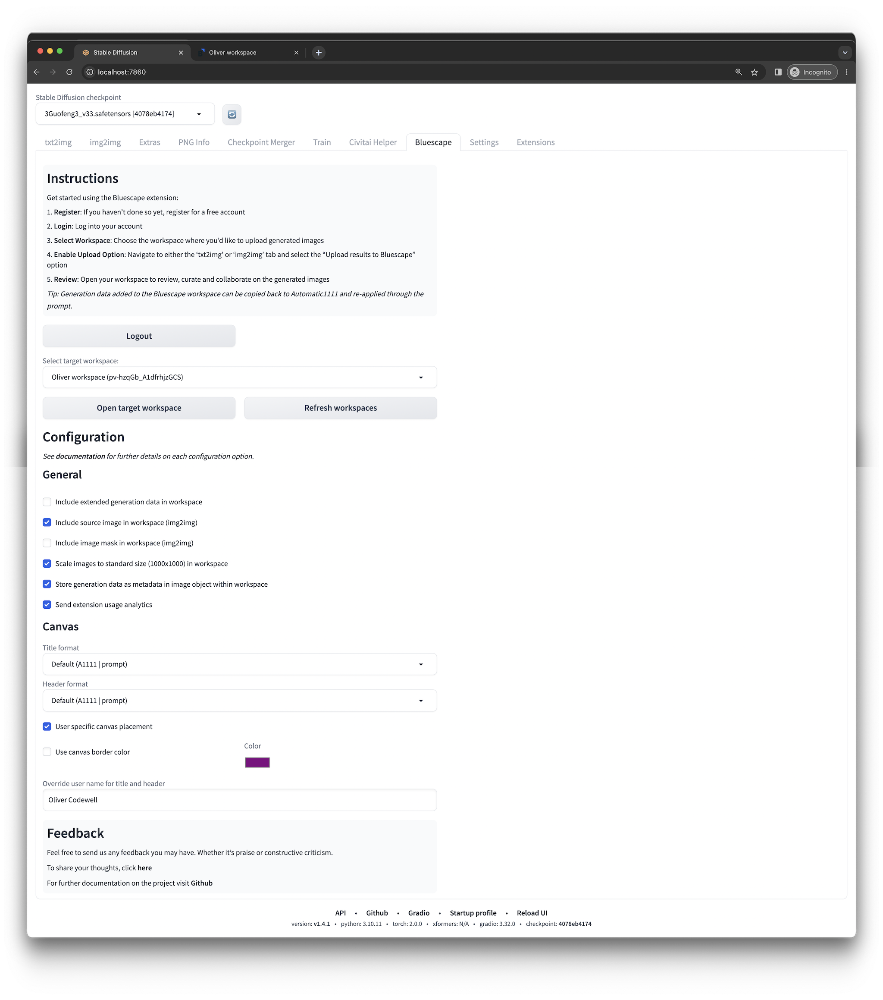
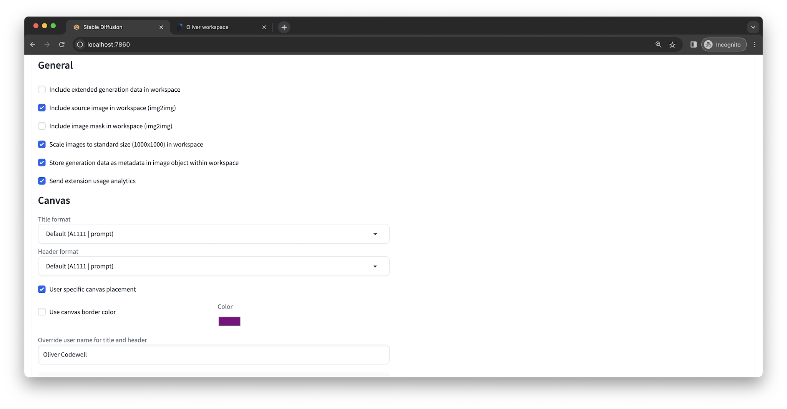

# Bluescape Extension for Stable Diffusion WebUI

Upload generated images to a Bluescape workspace for review and collaborate with others.

## Installation

1. Open "Extensions" tab.
2. Open "Install from URL" tab in the tab.
3. Enter  `https://github.com/Bluescape/sd-webui-bluescape`  to "URL for extension's git repository".
4. Press "Install" button.
5. Wait for 5 seconds, and you will see the message "Installed into stable-diffusion-webui\extensions\sd-webui-bluescape. Use Installed tab to restart".
6. Go to "Installed" tab, click "Check for updates", and then click "Apply and restart UI". (The next time you can also use these buttons to update the extension.)
7. Completely restart A1111 webui including the backend through your terminal

_Note: Currently the Bluescape extension only supports the standard A1111 domain / port `(localhost:7860)`._

## Getting started

Get started using the Bluescape extension:

1. **Open Extension**: Open the Bluescape tab on the A1111 webui
2. **Register**: If you haven’t done so yet, register for a free account by clicking the button
3. **Login**: Log into your account
4. **Select Workspace**: Choose the workspace where you’d like to upload generated images
5. **Enable Upload Option**: Navigate to either the ‘txt2img’ or ‘img2img’ tab and select the “Upload results to Bluescape” option
6. **Generate**: Generate images
7. **Review**: Open your workspace to review, curate and collaborate on the generated images

_Note: The free account has a limit on the number of workspaces and amount of data that can be stored in the workspace. Additional resources are available through paid plans._

## Configuration options

These are the defaults for the extension configuration options:

### Include extended generation data in workspace

By default the extension adds a text field to the workspace with the basic generation data:

Enabling extended generation data adds another text field with additional generation information:

_Note: The default generation data added to the Bluescape workspace can be copied back to Automatic1111 and re-applied through the prompt._

### Include source image in workspace (img2img)

Whether or not to include the source image in the workspace when using img2img:

### Include image mask in workspace (img2img)

Whether or not to include the image mask in the workspace when using img2img with masks.

### Scale images to standard size (1000x1000) in workspace

Whether to scale images to standard Bluescape image size of 1000x1000 in the workspace.

Note, that this only applies scaling at the workspace level and does not actually change the image data. You can always resize to original size in the workspace as well:

This is a good option to enable when you have a lot of images in the workspace from different sources and it works well when using images between 500-1000. However, if you work on large images of different aspect ratios it is best to turn this off.

### Store metadata in image object within workspace

When this is enabled the generation data and extended generation data are stored as metadata into the Bluescape workspace image elements. This is in anticipation of future Bluescape functionality that makes it easier to copy the generation data back to A1111 and other workflow improvements as well

You can disable this but it may limit the uploaded images from taking advantage of future A1111 related improvements in Bluescape.

### Send extension usage analytics

Whether to send analytics events about user registration, login and upload events. This helps Bluescape assess the amount of use the extension.

You can disable this if you'd like.

## Future aspirations

- Upload img2img masks to the workspace
- Upload ControlNet source image and mask to the workspace
- Image element context menu item to copy the generation data in A1111 webui compatible format
- A1111 running in non-default domain/port
- Retrigger image generation with same or modified parameters in A1111 directly from the workspace
- Additional layout options
- Browse and upload existing generated images from A1111

## Feedback and more information

Feel free to send us any feedback you may have either through Github or
[Bluescape community forums](https://community.bluescape.com/t/stable-diffusion-automatic1111-bluescape-extension/3730).

The extension is open source and licensed under [MIT License](LICENSE).

If you are interested in developing on the Bluescape platform, please take a look at the [developer documentation](https://api.apps.us.bluescape.com/docs/).
